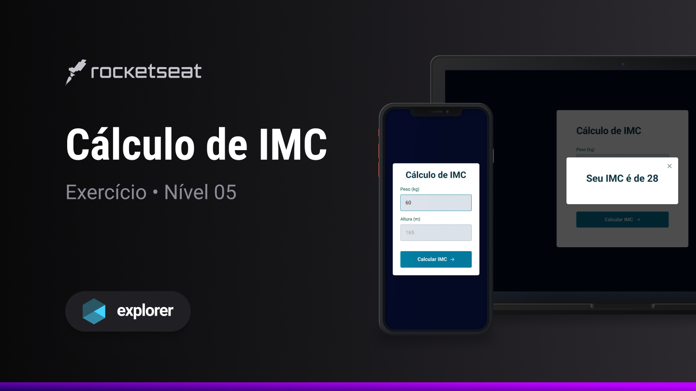

<h1 align="center">Cálculo de IMC</h1>

Explorer | Stage 05 - Cálculo de IMC

  <a href="#-tecnologias">Tecnologias</a>&nbsp;&nbsp;&nbsp;|&nbsp;&nbsp;&nbsp;
  <a href="#-projeto">Projeto</a>&nbsp;&nbsp;&nbsp;|&nbsp;&nbsp;&nbsp;
  <a href="#-licença">Licença</a>&nbsp;&nbsp;&nbsp;|&nbsp;&nbsp;&nbsp;
  <a href="#autor">Autor</a>

  

 

  

## 🚀 Tecnologias

Esse projeto foi desenvolvido com as seguintes tecnologias:

- HTML
- CSS
- JS

## 💻 Projeto

Este é um exercício ensinado durante o curso Explorer da [Rocketseat](https://www.rocketseat.com.br/).

No projeto Cálculo de IMC o usuário informa seu peso e altura para obter o seu IMC.

Alguns conceitos aplicados no projeto:

- Tags HTML semânticas
- CSS:
  - Grid
  - Transition
  - Variáveis
- JS:
  - Funções
  - Classes
  - Manipulando a DOM
  - Ouvindo Eventos da DOM
  - Variáveis
  - Objetos
  - Validação de dados
  - ES6 Modules
  - Modularização de componentes da aplicação
  - Regras básicas de Clean Code

## 📝 Licença

Esse projeto está sob a licença MIT.

## Autor

 

Feito com 💜 por Jordane Chaves
